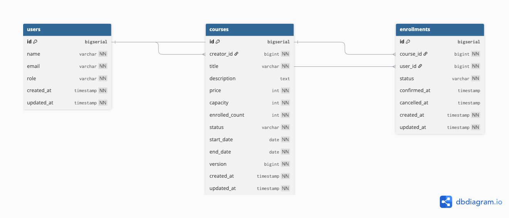

# Course Enrollment System
수강신청시스템

## 프로젝트 개요

크리에이터(강사)가 강의를 개설하고, 클래스메이트(수강생)가 수강 신청하는 시스템입니다.

정원 관리, 동시성 제어, 대기열 처리 기능을 포함하며, 동시 요청 상황에서도 데이터 정합성을 유지하는 것을 목표로 설계했습니다.

---

## 기술 스택

| 항목 | 기술 |
| --- | --- |
| Language | Java 17 |
| Framework | Spring Boot 3.3.5 |
| Build Tool | Gradle |
| Database | PostgreSQL |
| ORM | Spring Data JPA |
| Documentation | Swagger (springdoc-openapi 2.3.0) |
| Validation | Jakarta Validation |
| Utility | Lombok |

---

## 실행 방법

### Docker 실행 (권장)

```bash
./gradlew bootJar
docker-compose up --build
```

> 앱 컨테이너가 DB보다 먼저 뜰 수 있어요. 연결 오류 발생 시 잠시 후 재실행하세요.
> 
> 
> ```bash
> docker-compose restart app
> ```
> 

### 로컬 실행

PostgreSQL 실행 후:

```bash
./gradlew bootRun
```

### Swagger UI

```
http://localhost:8080/swagger-ui.html
```

---

## 요구사항 해석 및 가정

- 인증/인가는 간소화를 위해 `X-User-Id` 헤더 기반으로 처리
- 수강 취소는 결제 확정 후 7일 이내 가능하도록 설정
- 정원 초과 시 자동으로 대기열 등록
- 취소 발생 시 대기열 첫 번째 사용자가 자동 승격

---

## 설계 원칙

### 엔티티 설계

- Setter 사용 지양
- 상태 변경은 비즈니스 메서드로 처리
- 정적 팩토리 메서드 `create()` 사용
- Rich Domain Model 방식 적용

```java
public void increaseEnrolledCount() {
    this.enrolledCount++;
}
```

### 계층별 책임 분리

| 계층 | 역할 |
| --- | --- |
| Controller | 요청/응답 처리 |
| Service | 비즈니스 로직 처리 |
| Entity | 상태 및 도메인 규칙 관리 |
| Repository | 데이터 접근 |

> 도메인 레이어는 `IllegalStateException`을 사용하고, Service 계층에서 `BusinessException`으로 변환합니다.
엔티티가 `HttpStatus`를 알게 되면 레이어 의존성이 역전되기 때문입니다.
> 

---

## 동시성 처리 전략

### 낙관적 락 적용

```java
@Version
private Long version;
```

수강 신청은 동시에 여러 요청이 발생할 수 있기 때문에 낙관적 락을 적용했습니다.

마지막 남은 정원에 대한 동시 요청 상황에서:

- 먼저 커밋한 트랜잭션만 성공
- 이후 요청은 충돌 감지 후 대기열로 처리

### enrolled_count 역정규화 유지

매 요청마다 COUNT 쿼리를 수행하지 않도록 `enrolled_count` 컬럼을 유지했습니다.

- 빠른 정원 조회 가능
- 동시성 상황에서 즉시 정원 계산 가능
- `@Version`과 함께 정합성 유지

### 대기열 처리

낙관적 락 충돌 발생 시 `self-injection (@Lazy @Autowired)` + `REQUIRES_NEW` 트랜잭션을 사용해 별도 트랜잭션에서 대기열 등록을 처리했습니다.

---

## 데이터베이스 최적화

### Unique 제약

`enrollments` 테이블에 `UNIQUE(course_id, user_id)` 제약을 추가해 동일 사용자의 중복 신청을 방지했습니다.

Repository 레벨 중복 검사만으로는 동시 요청 상황에서 완전한 보장이 어렵기 때문에 DB 레벨에서도 무결성을 보장하도록 구성했습니다.

### 인덱스 전략

`enrollments` 테이블에 자주 사용되는 조회 조건에 인덱스를 추가했습니다.

| 컬럼 | 목적 |
| --- | --- |
| user_id | 사용자 신청 조회 |
| course_id | 강의별 신청 조회 |
| status | 상태 기반 조회 |

---

## API 문서

Swagger UI: `http://localhost:8080/swagger-ui.html`

OpenAPI Docs: `http://localhost:8080/api-docs`

---

## 공통 응답 형식

모든 API는 아래 형식으로 응답합니다.

```json
{
  "success": true | false,
  "message": "응답 메시지",
  "data": {} | null
}
```

**성공 예시**

```json
{
  "success": true,
  "message": "요청이 성공적으로 처리되었습니다.",
  "data": { ... }
}
```

**실패 예시**

```json
{
  "success": false,
  "message": "정원이 초과되었습니다.",
  "data": null
}
```

---

## API 목록

### User API

| Method | URL | 설명 |
| --- | --- | --- |
| POST | /api/users | 사용자 등록 |
| GET | /api/users/{userId} | 사용자 조회 |

**POST /api/users 요청**

```json
{
  "name": "김다빈",
  "email": "dabin@liveclass.com",
  "role": "CREATOR"
}
```

---

### Course API

| Method | URL | 설명 |
| --- | --- | --- |
| POST | /api/courses | 강의 등록 |
| GET | /api/courses | 강의 목록 조회 |
| GET | /api/courses/{courseId} | 강의 상세 조회 |
| PATCH | /api/courses/{courseId}/open | 강의 OPEN 전환 |
| PATCH | /api/courses/{courseId}/close | 강의 CLOSED 전환 |
| GET | /api/courses/{courseId}/enrollments | 수강생 목록 조회 |

**POST /api/courses 요청**

Header: `X-User-Id: 1`

```json
{
  "title": "Spring Boot 입문",
  "description": "Spring Boot 기초부터 실전까지",
  "price": 50000,
  "capacity": 30,
  "startDate": "2026-07-01",
  "endDate": "2026-08-31"
}
```

---

### Enrollment API

| Method | URL | 설명 |
| --- | --- | --- |
| POST | /api/enrollments | 수강 신청 |
| PATCH | /api/enrollments/{enrollmentId}/confirm | 결제 확정 |
| PATCH | /api/enrollments/{enrollmentId}/cancel | 수강 취소 |
| GET | /api/enrollments/me | 내 신청 목록 조회 |

**POST /api/enrollments 요청**

Header: `X-User-Id: 2`

```json
{
  "courseId": 1
}
```

---

## 데이터 모델



### users

| 컬럼 | 타입 | 설명 |
| --- | --- | --- |
| id | bigint | PK |
| name | varchar | 사용자 이름 |
| email | varchar | 이메일 (Unique) |
| role | varchar | CREATOR / CLASSMATE |
| created_at | timestamp | 생성 일시 |
| updated_at | timestamp | 수정 일시 |

### courses

| 컬럼 | 타입 | 설명 |
| --- | --- | --- |
| id | bigint | PK |
| creator_id | bigint | 강사 FK |
| title | varchar | 강의 제목 |
| description | text | 강의 설명 |
| price | int | 강의 가격 |
| capacity | int | 정원 |
| enrolled_count | int | 현재 신청 인원 (역정규화) |
| status | varchar | DRAFT / OPEN / CLOSED |
| start_date | date | 수강 시작일 |
| end_date | date | 수강 종료일 |
| version | bigint | 낙관적 락 버전 |
| created_at | timestamp | 생성 일시 |
| updated_at | timestamp | 수정 일시 |

### enrollments

| 컬럼 | 타입 | 설명 |
| --- | --- | --- |
| id | bigint | PK |
| course_id | bigint | 강의 FK |
| user_id | bigint | 사용자 FK |
| status | varchar | PENDING / CONFIRMED / CANCELLED / WAITLISTED |
| confirmed_at | timestamp | 결제 확정 시각 |
| cancelled_at | timestamp | 취소 시각 |
| created_at | timestamp | 생성 일시 |
| updated_at | timestamp | 수정 일시 |

---

## 테스트

### 테스트 실행

```bash
./gradlew test
```

### 테스트 전략

| 테스트 | 내용 |
| --- | --- |
| UserServiceTest | 사용자 등록, 중복 이메일, 조회, 없는 사용자 조회 |
| CourseServiceTest | 강의 등록, 상태 전이, 권한 검증, 목록 필터 |
| EnrollmentServiceTest | 동시성 처리 및 대기열 검증 (5스레드 동시 요청) |
| Duplicate Enrollment Test | 중복 신청 방지 검증 |

---

## 제약 사항

- 실제 결제 시스템 미연동
- 인증/인가 미구현 (`X-User-Id` 헤더로 대체)
- Redis 기반 분산 락 미적용
- 대기열 동시성 처리 개선 여지 있음
    - 현재 `self-injection` 방식은 기술적 한계 우회책으로, 근본적으로는 트랜잭션 경계 재설계가 필요

---

## AI 활용 범위

### AI가 한 것
- 엔티티, Repository, Service, Controller 코드 초안 작성
- 테스트 코드 초안 작성
- README 초안 작성
- 커밋 메시지 추천

### 직접 검토 및 수정한 것
- 낙관적 락 충돌 시 대기열 등록이 롤백되는 문제 발견 → self-injection으로 수정
- 엔티티가 `BusinessException`을 던지면 `HttpStatus`에 의존하게 되는 레이어 의존성 문제 발견 → `IllegalStateException`으로 수정
- DB 최적화(인덱스/Unique 제약) 검토 및 적용 여부 판단
- 테스트 코드 직접 실행 및 결과 검증
- Docker 이미지 플랫폼 호환성 문제(Apple Silicon) 직접 해결